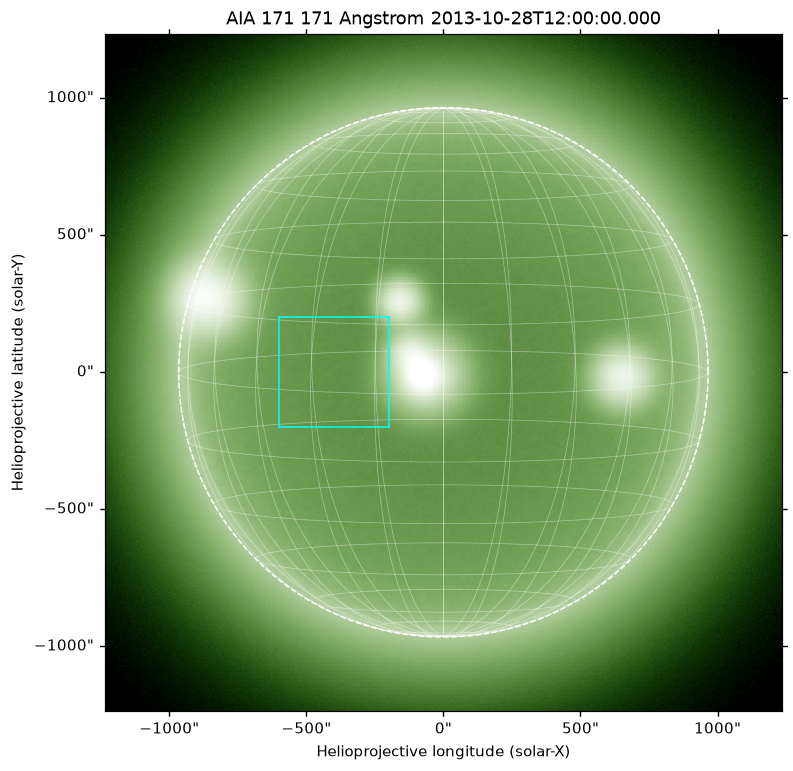
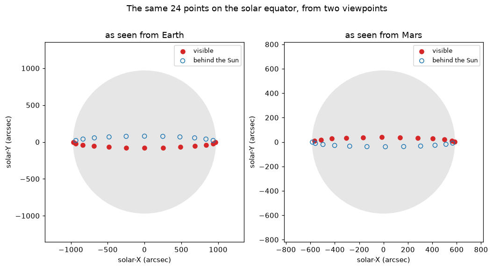
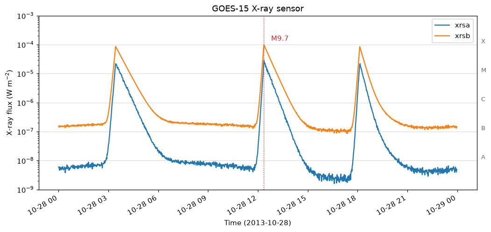
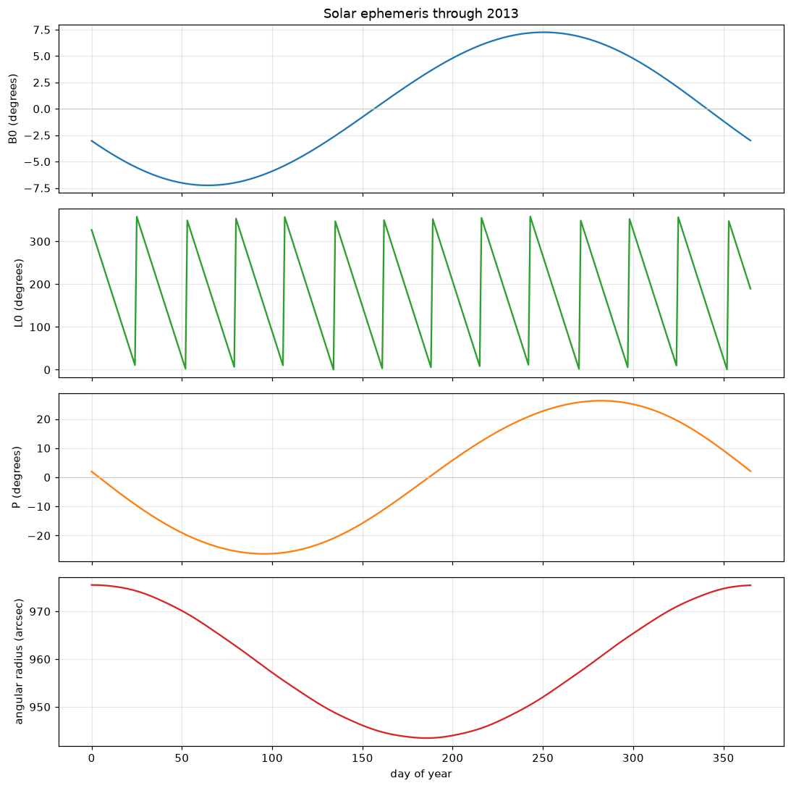

# Heliox

A solar physics toolkit for Python, built on `astropy`, `numpy`, `scipy`,
`matplotlib` and `pandas`.

`Heliox` provides the data structures solar physics analysis is written in: a
coordinate-aware `Map` for solar images, a `TimeSeries` for instrument light
curves, a full set of solar coordinate frames plugged into
`astropy.coordinates`, and the ephemeris, rotation and plotting machinery that
ties them together.

Everything runs offline. The sample data is generated on your machine the first
time you use it, so there is nothing to download and every example in the
documentation is reproducible.

```python
import astropy.units as u
import Heliox.map
from Heliox.data.sample import AIA_171_IMAGE

aia = Heliox.map.Map(AIA_171_IMAGE)
aia.peek(draw_limb=True, draw_grid=15 * u.deg)
```



## Installing

```bash
git clone https://github.com/pragyaangaur/Heliox
cd Heliox
pip install -e .
```

Python 3.10 or later.

## What it does

### Images that know where they are pointing

A map bundles the array, its metadata and the coordinate frame that turns pixel
indices into positions on the Sun. Once those travel together, cropping,
rotating and overlaying can be expressed physically instead of in pixels.

```python
from astropy.coordinates import SkyCoord

# Crop by where it is on the Sun, not by pixel index.
corner = SkyCoord(-700 * u.arcsec, -300 * u.arcsec, frame=aia.coordinate_frame)
region = aia.submap(corner, width=600 * u.arcsec, height=600 * u.arcsec)

# Rotate so solar north is up; the WCS is updated to match.
upright = region.rotate()

# The same physical point, found correctly in either map.
target = SkyCoord(-400 * u.arcsec, 0 * u.arcsec, frame=aia.coordinate_frame)
upright.world_to_pixel(target)
```

The `Map` factory picks an instrument-specific class from the header, so an AIA
file arrives as an `AIAMap` with the right colour table and display scaling
already chosen.

### Solar coordinate frames

Five frames, registered in astropy's transform graph, so `.transform_to` works
between any of them and any celestial frame astropy knows about. The rotation
matrices are built from the IAU solar rotation elements, and reproduce the
classical `B0` and `L0` ephemeris to a fraction of an arcsecond by an entirely
independent route.

```python
from Heliox.coordinates import Helioprojective, get_body_heliographic_stonyhurst

disc_centre = SkyCoord(0 * u.arcsec, 0 * u.arcsec, frame=Helioprojective,
                       obstime='2013-10-28T12:00:00', observer='earth')

mars = get_body_heliographic_stonyhurst('mars', '2013-10-28T12:00:00')
disc_centre.transform_to(Helioprojective(obstime='2013-10-28T12:00:00', observer=mars))
# <Helioprojective ...: (Tx, Ty, distance) in (arcsec, arcsec, AU) (-581.1, 46.9, 1.64)>
```

In October 2013 Mars was 91.5 degrees ahead of the Earth in heliographic
longitude, so the centre of the Earth's view of the disc sits right at the edge
of Mars's.



### Time series with units attached

```python
import Heliox.timeseries
from Heliox.data.sample import GOES_XRS_TIMESERIES

goes = Heliox.timeseries.TimeSeries(GOES_XRS_TIMESERIES)
goes.flare_class     # 'M9.7'
goes.peak_time       # <Time object: 2013-10-28T12:22:00.000>
goes.units['xrsb']   # Unit("W / m2")
```



### Searching

Queries are built from physical attributes and dispatched to whichever client
can serve them, so you describe what you want rather than where it lives.

```python
from Heliox.net import Fido, attrs as a

results = Fido.search(
    a.Time('2013-10-28', '2013-10-29')
    & (a.Instrument('AIA') | a.Instrument('HMI'))
)
files = Fido.fetch(results)
```

Heliox ships one client, which searches the built-in sample catalogue. It
implements exactly the interface a network client would, so adding a real
archive means writing another `BaseClient`.

### The Sun itself

```python
from Heliox.sun import sun, constants

sun.B0('2013-10-28')                       # <Quantity 4.77 deg>
sun.carrington_rotation_number('2013-10-28')  # 2143.09...
constants.radius.to('km')                  # <Quantity 695700. km>
```



## Examples

Nine runnable scripts live in [`examples/`](examples/), covering plotting,
compositing, running differences, parallax between observers, differential
rotation, flare light curves and the solar cycle. Each one runs on its own and
saves a figure:

```bash
python examples/maps/plot_aia_with_overlays.py
```

## Documentation

```bash
pip install -e ".[docs]"
sphinx-build -b html docs docs/_build/html
```

The user guide covers [maps](docs/guide/maps.rst),
[coordinates](docs/guide/coordinates.rst),
[time series](docs/guide/timeseries.rst) and
[searching](docs/guide/searching.rst).

## Development

```bash
pip install -e ".[dev]"
pytest
```

Over 800 tests, plus the docstring and documentation examples, all run offline.
See [CONTRIBUTING.md](CONTRIBUTING.md).

## Relationship to SunPy

Heliox is an independent reimplementation, written to understand how a solar
physics toolkit fits together. The API is deliberately similar to
[SunPy](https://sunpy.org)'s, because SunPy's design is a good one and
familiarity is worth something, but no code is shared and the two are not
compatible. **For real scientific work, use SunPy.** It is maintained by the
community, validated against real data, and has instrument support that this
does not.

## License

BSD 3-Clause. See [LICENSE](LICENSE).
